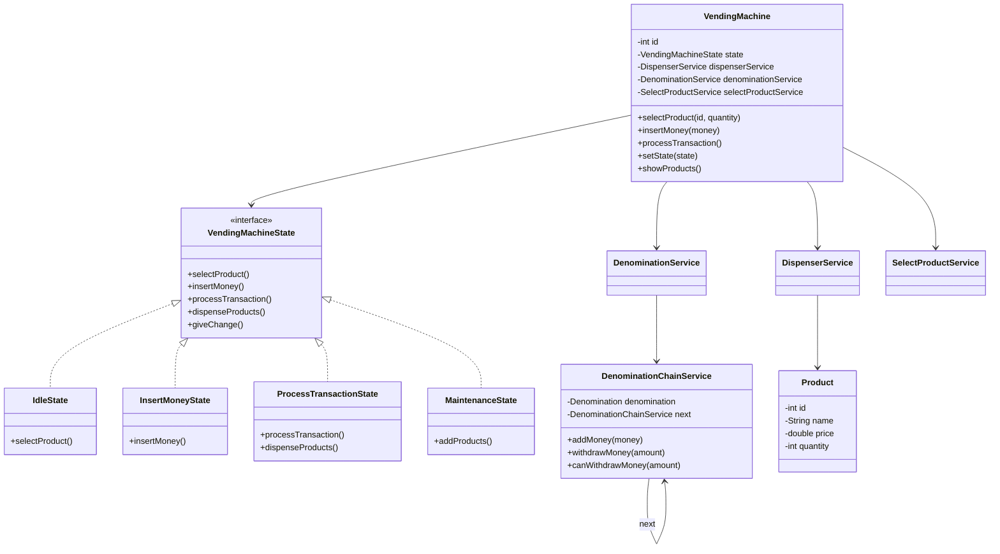

# Vending Machine System - Low Level Design (LLD)

A robust and scalable implementation of a Vending Machine system in Java, focusing on clean code, design patterns, and modular architecture.

## 🚀 Key Features

-   **State-Driven Logic**: Uses the **State Design Pattern** to manage machine transitions seamlessly.
-   **Intelligent Change Calculation**: Implements a **Chain of Responsibility** for denomination handling, ensuring optimal change return.
-   **Modular Services**: Decoupled services for Product Selection, Inventory Management (Dispenser), and Transactions.
-   **Capacity Management**: Real-time tracking of product stock and cash reserves.
-   **Maintenance Support**: Administrative state for restocking and system updates.

## 🛠 Architecture & Design Patterns

### 1. State Design Pattern
The machine operates in different states, each handling actions according to its current context.
-   **IdleState**: Waiting for user interaction.
-   **InsertMoneyState**: Collecting payments from the user.
-   **ProcessTransactionState**: Validating payment and dispensing products.
-   **MaintenanceState**: Reserved for administrative tasks (adding products/cash).
-   **OutOfServiceState**: System lock when errors or inventory issues occur.

### 2. Chain of Responsibility
Used for handling denominations. Each node in the chain represents a specific currency value (e.g., $10, $5, $1) and handles its part of the total amount, passing the rest to the next handler.

### 3. Service Layer
-   **DispenserService**: Manages the physical (simulated) release of products and inventory levels.
-   **DenominationService**: Manages the cash vault and change logic.
-   **SelectProductService**: Tracks the user's current shopping cart and total cost.
-   **TransactionService**: Records and audits every purchase.

## 📊 UML Diagram

## 📂 Folder Structure

-   `src/models/`: Core entities (`Product`, `Transaction`, `Denomination`).
-   `src/states/`: Implementation of the State Pattern.
-   `src/services/`: Business logic and denomination chains.
-   `src/enums/`: Constants for Transaction types and UI states.

## 🔄 Workflow

1.  **Selection**: User selects products via `VendingMachine`. The `SelectProductService` validates availability.
2.  **Payment**: Machine moves to `InsertMoneyState`. User provides a map of denominations.
3.  **Processing**: `ProcessTransactionState` checks if the total paid >= total cost.
4.  **Change & Dispense**: `DenominationService` calculates change. `DispenserService` reduces stock and releases items.
5.  **Completion**: Machine resets back to `IdleState`.
