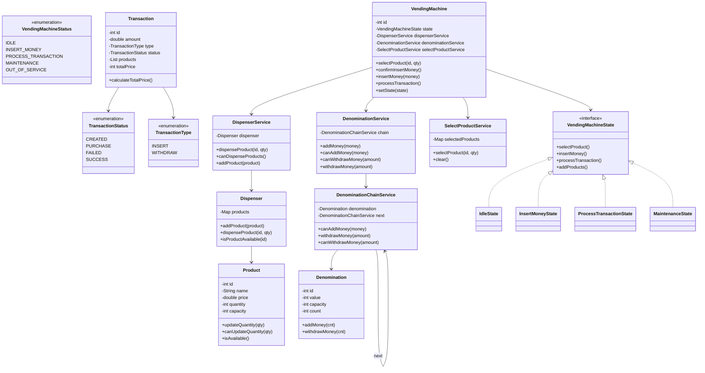

# Vending Machine System - Low Level Design (LLD)

A robust, scalable, and highly validated implementation of a Vending Machine system in Java. This project demonstrates clean code practices, SOLID principles, and advanced design patterns to handle real-world scenarios like multi-product selection, precise change calculation, and inventory/capacity management.

## 🚀 Key Features

-   **State-Driven Logic**: Utilizes the **State Design Pattern** to manage machine transitions (Idle, Payment, Processing, Maintenance) without complex if-else blocks.
-   **Advanced Change Algorithm**: Implements a **Chain of Responsibility** with a greedy algorithm to handle denominations, ensuring the system can return optimal change or reject transactions if change is unavailable.
-   **Strict Input Validation**: Rejects invalid IDs, negative quantities, and zero-count orders at the entry point.
-   **Capacity & Stock Tracking**: Real-time tracking of both product stock and denomination vault limits.
-   **Maintenance Suite**: A dedicated administrative interface for restocking products and managing cash reserves.
-   **Robust Test Suite**: Includes 15+ comprehensive test cases covering edge cases like vault overflows, out-of-stock scenarios, and exact change flows.

## 🛠 Architecture & Design Patterns

### 1. State Design Pattern
The machine transitions through predefined states defined in the `states` package. Each state encapsulates the behavior allowed during that phase.
-   **IdleState**: Waiting for product selection.
-   **InsertMoneyState**: Collecting money from the user.
-   **ProcessTransactionState**: Validating payment, calculating change, and triggering dispense logic.
-   **MaintenanceState**: Admin-only state for system updates.

### 2. Chain of Responsibility
Used in the `DenominationChainService`. Each handler represents a specific denomination (e.g., 10, 5, 1). It greedily subtracts as much as possible from the required change amount before passing the remainder to the next handler.

### 3. Service-Oriented Architecture
-   **DispenserService**: High-level API for inventory management and physical dispensing.
-   **DenominationService**: Orchestrates the cash vault and change handlers.
-   **SelectProductService**: Manages the user's active shopping cart and price calculation.
-   **TransactionService**: Handles logging and retrieval of purchase history.

## 📊 Detailed UML Diagram



## 📂 Folder Structure

```text
src/
├── enums/       # Status codes and transition types
├── models/      # Core entities (Product, Denomination, Dispenser, Transaction)
├── services/    # Business logic (Dispensing, Denominations, Selection)
├── states/      # State pattern implementation
├── VendingMachine.java # Context class (Entry point for interactions)
└── App.java     # Main class with Robustness Test Suite
```

## 🔄 Workflow

1.  **Selection**: User selects items via `selectProduct()`. `SelectProductService` validates stock and increments quantities correctly.
2.  **Confirmation**: User calls `confirmInsertMoney()` to transition the machine from `IDLE` to `INSERT_MONEY`.
3.  **Payment**: User calls `insertMoney()`. The system automatically wraps this in a `ProcessTransactionState`.
4.  **Validation**: `ProcessTransactionState` performs three critical checks:
    -   Are products still in stock?
    -   Does the vault have space for the inserted coins?
    -   Can the vault provide the exact change required?
5.  **Execution**: If all pass, stock is reduced, money is added/withdrawn from the vault, and the cart is cleared.
6.  **Cleanup**: Machine resets to `IdleState` for the next customer.

## 🧪 Running Tests

The project includes a `Robustness Test Suite` in `App.java`. To compile and run the tests:

```bash
# Compile
javac -d bin -cp src src/App.java src/models/*.java src/services/*.java src/states/*.java src/enums/*.java

# Run
java -cp bin App
```
